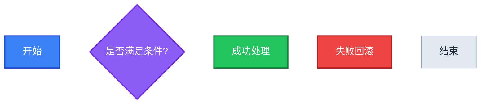
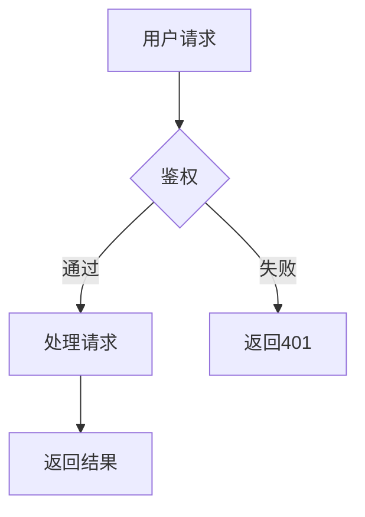
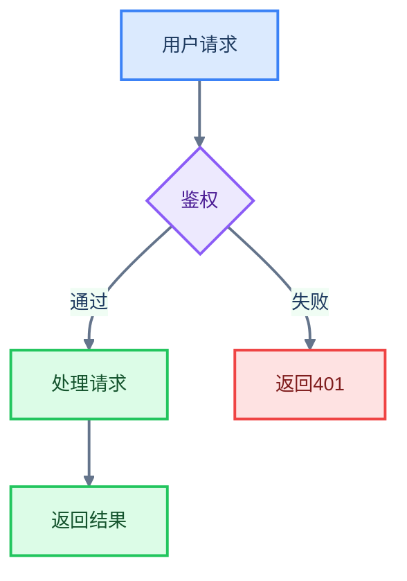

# Mermaid Beautify

## Overview

将普通 Mermaid 代码美化为有主题、有配色、有节点分组样式的版本。**输出必须始终是合法的 Mermaid 语法**，不转换为 SVG 或图片。

**核心约束：只有 `base` theme 支持 `themeVariables` 自定义。其他主题（default/dark/forest/neutral）不可修改颜色。**

---

## Step 1: 用 frontmatter 注入主题

所有美化都通过在 Mermaid 代码块顶部加 frontmatter 实现：

```
---
config:
  theme: base
  themeVariables:
    darkMode: false
    background: "#ffffff"
    primaryColor: "#XXXXXX"
    primaryTextColor: "#XXXXXX"
    primaryBorderColor: "#XXXXXX"
    lineColor: "#XXXXXX"
    secondaryColor: "#XXXXXX"
    tertiaryColor: "#XXXXXX"
    fontFamily: "ui-sans-serif, system-ui, sans-serif"
    fontSize: "14px"
---
flowchart TD
  ...
```

---

## Step 2: 选择预设主题

根据用户偏好或上下文选择，**默认使用 GitHub Light**（最通用、浅色背景 Markdown 最适配）。

### 浅色主题

#### GitHub Light（默认推荐）
```yaml
themeVariables:
  darkMode: false
  background: "#ffffff"
  primaryColor: "#dbeafe"
  primaryTextColor: "#1e3a5f"
  primaryBorderColor: "#3b82f6"
  lineColor: "#64748b"
  secondaryColor: "#f0fdf4"
  tertiaryColor: "#fef9c3"
  noteBkgColor: "#fef9c3"
  noteTextColor: "#713f12"
  fontFamily: "ui-sans-serif, system-ui, sans-serif"
  fontSize: "14px"
```

#### Catppuccin Latte（柔和暖色）
```yaml
themeVariables:
  darkMode: false
  background: "#eff1f5"
  primaryColor: "#e6e9ef"
  primaryTextColor: "#4c4f69"
  primaryBorderColor: "#7c7f93"
  lineColor: "#5c5f77"
  secondaryColor: "#dce0e8"
  tertiaryColor: "#ccd0da"
  noteBkgColor: "#fae5c8"
  noteTextColor: "#8c3b1b"
  fontFamily: "ui-sans-serif, system-ui, sans-serif"
  fontSize: "14px"
```

#### Solarized Light（护眼暖白）
```yaml
themeVariables:
  darkMode: false
  background: "#fdf6e3"
  primaryColor: "#eee8d5"
  primaryTextColor: "#586e75"
  primaryBorderColor: "#268bd2"
  lineColor: "#839496"
  secondaryColor: "#e8e2cf"
  tertiaryColor: "#f5efdc"
  noteBkgColor: "#f5efdc"
  noteTextColor: "#657b83"
  fontFamily: "ui-monospace, SFMono-Regular, monospace"
  fontSize: "13px"
```

### 深色主题

#### Tokyo Night（深色紫蓝）
```yaml
themeVariables:
  darkMode: true
  background: "#1a1b26"
  primaryColor: "#283457"
  primaryTextColor: "#c0caf5"
  primaryBorderColor: "#7aa2f7"
  lineColor: "#565f89"
  secondaryColor: "#1f2335"
  tertiaryColor: "#24283b"
  noteBkgColor: "#24283b"
  noteTextColor: "#9ece6a"
  fontFamily: "ui-sans-serif, system-ui, sans-serif"
  fontSize: "14px"
```

#### Catppuccin Mocha（深色马卡龙）
```yaml
themeVariables:
  darkMode: true
  background: "#1e1e2e"
  primaryColor: "#313244"
  primaryTextColor: "#cdd6f4"
  primaryBorderColor: "#89b4fa"
  lineColor: "#6c7086"
  secondaryColor: "#292a3e"
  tertiaryColor: "#1e1e2e"
  noteBkgColor: "#2a2a3e"
  noteTextColor: "#a6e3a1"
  fontFamily: "ui-sans-serif, system-ui, sans-serif"
  fontSize: "14px"
```

#### Nord（北欧冰蓝）
```yaml
themeVariables:
  darkMode: true
  background: "#2e3440"
  primaryColor: "#3b4252"
  primaryTextColor: "#d8dee9"
  primaryBorderColor: "#88c0d0"
  lineColor: "#616e88"
  secondaryColor: "#434c5e"
  tertiaryColor: "#4c566a"
  noteBkgColor: "#3b4252"
  noteTextColor: "#a3be8c"
  fontFamily: "ui-sans-serif, system-ui, sans-serif"
  fontSize: "14px"
```

#### Dracula（经典紫粉）
```yaml
themeVariables:
  darkMode: true
  background: "#282a36"
  primaryColor: "#383a59"
  primaryTextColor: "#f8f8f2"
  primaryBorderColor: "#bd93f9"
  lineColor: "#6272a4"
  secondaryColor: "#323444"
  tertiaryColor: "#2d2f45"
  noteBkgColor: "#2d2f45"
  noteTextColor: "#50fa7b"
  fontFamily: "ui-sans-serif, system-ui, sans-serif"
  fontSize: "14px"
```

#### Gruvbox Dark（复古暖棕）
```yaml
themeVariables:
  darkMode: true
  background: "#282828"
  primaryColor: "#3c3836"
  primaryTextColor: "#ebdbb2"
  primaryBorderColor: "#83a598"
  lineColor: "#7c6f64"
  secondaryColor: "#32302f"
  tertiaryColor: "#1d2021"
  noteBkgColor: "#3c3836"
  noteTextColor: "#b8bb26"
  fontFamily: "ui-monospace, SFMono-Regular, monospace"
  fontSize: "13px"
```

---

## Step 3: flowchart 节点分组（可选）

给 flowchart 中不同类型节点加 `classDef` 样式，使节点按角色区分颜色：



**节点角色映射参考：**
| classDef | 适用节点 |
|----------|---------|
| `primary` | 主流程节点、开始/入口 |
| `success` | 成功状态、完成 |
| `warning` | 警告、需要注意 |
| `danger` | 失败、错误、终止 |
| `neutral` | 辅助节点、说明 |
| `decision` | 判断菱形节点 |

---

## Step 4: 连线样式（可选）

```mermaid
flowchart TD
  linkStyle default stroke:#64748b,stroke-width:2px
```

对特定连线（按 0-based 索引）：
```mermaid
linkStyle 0 stroke:#ef4444,stroke-width:3px
linkStyle 1,2 stroke:#22c55e,stroke-width:2px
```

---

## 完整示例

### 输入（原始）


### 输出（GitHub Light 主题 + classDef）
````markdown

````

输出 Mermaid 代码后，紧接着用以下格式说明分组逻辑：

```
颜色分组逻辑：
- 蓝（primary）：A/B，说明这组节点的语义
- 绿（success）：C/D，说明这组节点的语义
- 紫（decision）：E，说明这组节点的语义
```

格式要求：`颜色中文名（classDef名）：节点字母/节点字母，语义说明`

---

## 规则

1. **输出始终是 Mermaid 语法**，不生成 SVG、图片或字符画
2. **frontmatter 必须在代码块内**（不是 markdown frontmatter）
3. **只用十六进制颜色**，不用颜色名（`#ff0000` ✓，`red` ✗）
4. 深色主题必须设 `darkMode: true`
5. `classDef` 只适用于 `flowchart`/`graph`，不适用于 `sequenceDiagram`/`stateDiagram`
6. 如果用户未指定主题，**默认 GitHub Light**
7. 如果文档背景是深色或用户明确要深色，推荐 Tokyo Night 或 Nord
8. **所有缩进必须使用空格，禁止使用 tab**（Mermaid 解析器对 tab 不兼容，会导致渲染失败）
